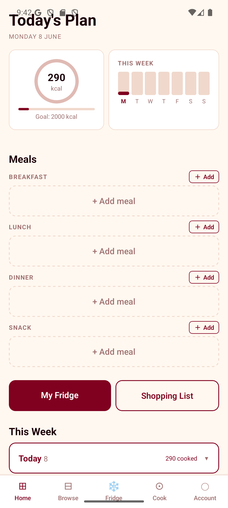

# MealPlanner

An Android app I built for my own cooking: plan the day's meals, track
calories, see what I can cook with what is in the fridge, and build a
shopping list from what is missing.



## What it does

- **Today's plan**: breakfast, lunch, dinner and snack slots, a calorie goal
  and a week view.
- **Browse**: 150 built-in recipes with filters for meal time and tags
  (vegetarian, vegan, high-protein, low-carb, quick, gluten-free).
- **Fridge**: keep a list of what you have. Recipes are matched against it
  with fuzzy ingredient names, substitution groups (butter and oil, different
  pastas, stocks) and pantry staples that are assumed to be there.
- **Voice input**: say "I've got eggs and milk but I ran out of flour" and the
  fridge is updated (add and remove in one sentence).
- **Shopping list**: the missing ingredients for planned recipes.
- **Cook mode**: step by step, split into preparing, cooking and assembling.
- Favourites and adding your own recipes.

10 screens in total.

## Built with

TypeScript, React Native 0.81, Expo SDK 54, React Navigation,
AsyncStorage, expo-sqlite, @react-native-voice/voice.

The `scraper/` folder is a separate Node.js tool that collects recipes from
three recipe sites into SQLite, with Python scripts to clean the images.

## Work in progress

- Moving from the built-in recipe list to a SQLite database of about 1,800
  scraped recipes (`src/utils/database.ts`, `recipeQuery.ts`). The database
  is not in the repo because the recipes belong to their original sites. Run
  the scraper to build your own copy as `assets/recipes.db`.
- Account and Community screens are placeholders.

## Run it

```bash
npm install
npx expo run:android
```

Needs Android Studio or a connected Android phone with USB debugging.

## How it was made

Planned, tested and used daily by me. I used Claude Code as a coding
assistant for parts of the implementation.
